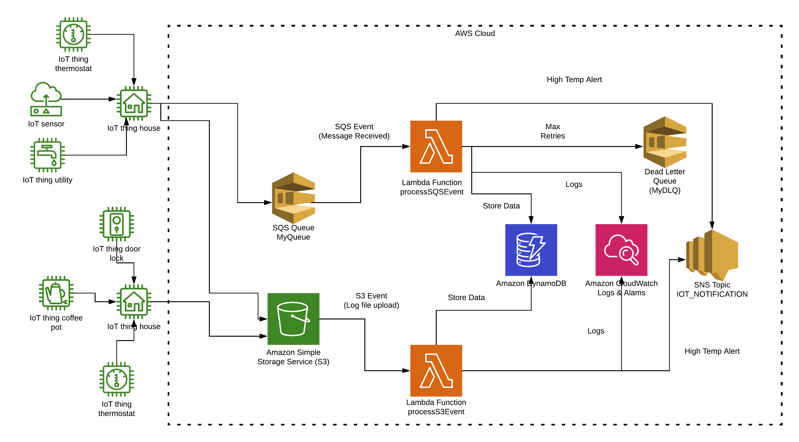

# Smart Home IoT Event Processor

## Introduction
The Smart Home IoT Event Processor is a serverless application designed to process events from various IoT devices. This application uses AWS services to handle event-driven data processing, transformation, and storage in DynamoDB. It ensures efficient data handling, logging, and monitoring while providing notifications for critical events.

## Architecture



### Architecture Components

1. **S3 Bucket (smart-home-iot-logs)**
   - Stores incoming IoT device logs as files.
   - Triggers Lambda function on new file uploads.

2. **SQS Queue (MyQueue)**
   - Receives real-time sensor data as messages from IoT devices.
   - Triggers Lambda function on new messages.

3. **Lambda Functions**
   - **processS3Event**: Processes data from the S3 bucket.
   - **processSQSEvent**: Processes data from the SQS queue.
   - Both functions transform the data, filter irrelevant entries, and store relevant data in DynamoDB.

4. **DynamoDB Table (smart-home-iot-event-processor-table)**
   - Stores the transformed and processed IoT data.
   - Supports efficient querying for analysis and monitoring.

5. **SNS Topic (IOT_NOTIFICATION)**
   - Sends notifications for critical events, such as high-temperature alerts.

6. **CloudWatch**
   - Logs and monitors Lambda function performance and errors.
   - Triggers alarms for error notifications.

7. **Dead Letter Queue (MyDLQ)**
   - Receives messages that fail to be processed after a specified number of retries.

## Setup Guide

### Prerequisites
- **Node.js** and **npm** installed.
- **Serverless Framework** installed (`npm install -g serverless`).
- **AWS CLI** configured with appropriate credentials.
- **AWS account** with permissions to create and manage the required resources.

### Step-by-Step Setup

1. **Clone the Repository**

   ```bash
   git clone https://github.com/your-repository-link
   cd event-processor
1.  ```bash
    npm install
2.  Ensure the serverless.yml file has the correct ARNs and bucket names:
    
    *   Update SNS\_TOPIC\_ARN with your SNS topic ARN.
        
    *   Ensure DYNAMODB\_TABLE matches the name of your DynamoDB table.
        
    *   Ensure the S3 bucket name (smart-home-iot-logs) matches your existing bucket.
    
3.  ```bash 
        serverless deploy

4.  **Verify Deployment**
    
    *   **Lambda Functions**: Check the AWS Console to ensure the Lambda functions (processS3Event and processSQSEvent) are created.
        
    *   **DynamoDB Table**: Verify the DynamoDB table (smart-home-iot-event-processor-table) is created.
        
    *   **SQS Queue**: Ensure the SQS queue (MyQueue) and Dead Letter Queue (MyDLQ) are created.
        
    *   **SNS Topic**: Confirm the SNS topic (IOT\_NOTIFICATION) is set up correctly.
        
    *   **S3 Bucket**: Verify the S3 bucket (smart-home-iot-logs) is being used correctly.
        

### Usage Instructions

1.  **Generate Events**
    
    *   **S3 Events**: Upload a file to the S3 bucket (smart-home-iot-logs) to trigger the processS3Event Lambda function.
        
        *   Use the AWS S3 console or the AWS CLI to upload files.
            
    *   **SQS Events**: Send a message to the SQS queue (MyQueue) to trigger the processSQSEvent Lambda function.
        
        *   Use the AWS SQS console or the AWS CLI to send messages.
            
2.  **Monitoring and Notifications**
    
    *   **CloudWatch Logs**: Monitor the performance and errors of the Lambda functions via CloudWatch logs.
        
    *   **SNS Notifications**: Receive email notifications for critical events, such as high-temperature alerts.
        

### Example Test Commands

*   ```bash
    aws s3 cp test/data/device1_data_log.json s3://smart-home-iot-logs/device1_data_log.json
*   ```bash 
    aws sqs send-message --queue-url https://sqs.{AWS_REGION}.amazonaws.com/{ACCOUNT_ID}/MyQueue --message-body "{\"device_id\": \"device1\", \"timestamp\": \"2024-06-13T10:15:00Z\", \"temperature\": 80, \"humidity\": 45.2, \"location\": \"living_room\"}"
### Reflection

#### Challenges Faced

*   Ensuring proper IAM permissions for all AWS services.
    
*   Handling continuous retries for failed SQS messages by configuring a Dead Letter Queue.
    
*   Managing environment variables and configurations for seamless integration.
    

#### Lessons Learned

*   Effective use of the Serverless Framework for managing AWS resources.
    
*   Efficiently handling event-driven architectures with AWS Lambda and SQS.
    
*   Importance of monitoring and logging for troubleshooting and performance optimization.
    

#### Potential Improvements

*   Implementing additional data validation and transformation logic.
    
*   Enhancing error handling mechanisms for more robust processing.
    
*   Integrating more advanced monitoring and alerting solutions.
    

Conclusion
----------

The Smart Home IoT Event Processor demonstrates a scalable, efficient, and serverless approach to handling IoT data. By leveraging AWS services, it ensures real-time processing, reliable storage, and effective monitoring, making it a robust solution for smart home data management.